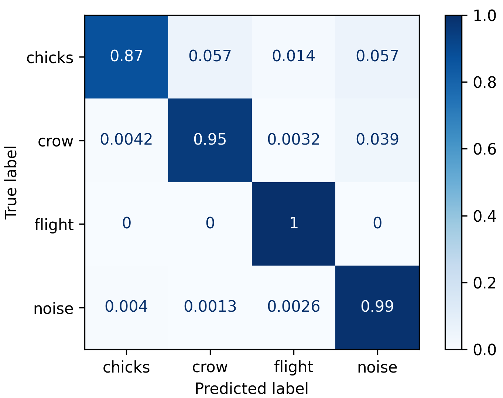

# Classification of corvid sound (part I)
  * **Author**: Víctor Moreno-González <vmorg@unileon.es>
  * **Date**: 2020-09-17

# Table of content
1. [Introduction](#introduction)
    * [Motivation](#motivation)
    * [Aim](#aim)
1. [Procedure](#procedure)
    * [Stage 0 -- Vocalization extraction](#stage-0.-vocalization-extraction)
    * [Stage 1 -- Train a model for crow recognition](#stage-1.-train-a-model-for-crow-recognition)
    * [Stage 2 -- Use the model to select crow vocalizations](#stage-2.-use-the-model-to-select-carrion-crow-vocalizations)
    * [Stage 3 -- Manual selection of crow calls](#stage-3.-manual-selection-of-carrion-crow-vocalizations)
1. [Caveats of this method](#caveats-of-this-method)
1. [Questions to be addressed](#questions-to-be-addressed-for-the-future)

# Introduction
## Motivation
Automatic crow vocalization recognition has been a tough
task since it is very difficult to correctly differentiate
those vocalizations from the background noise.
In addition, though most carrion crow vocalizations rely
on the same frequency band, several low-amplitude vocalizations
exists that are almost impossible to select with amplitude-based selectors.
Thus, with the help of the GVIS group from the University of León, I
will use a new methodology for automatic selection of crow
vocalizations in the whole dataset (about 4000 H). Subsequently,
I will use this dataset to perform an objective
classification of crow vocalizations.

## Aim

1. To develop a semi-automatic method to select carrion crow vocalizations.
    * Build the training dataset
    * Train a neural network model to recognize regions with carrion crow
      vocalizations.
    * Use the trained model to manually select the boundaries of
      each vocalization.

----

# Procedure

## Stage 0. Vocalization extraction
The model is intended to classify 5s-clips according to the
next classes:
  
  * `crow`: contains at least a part of a carrion crow vocalization
  * `chicks`: contains sounds produced by the chicks (only heard when the
              carrion crow visits the nest).
  * `flights`: contains the typical noise produced when the carrion crow
              is flying.
  * `noise`: contains any other noise recorded by the microphone.

In past analyses, I have extracted some vocalizations as
well as environment, flight and chick noises (Table 1).
For a better training of the model, I have performed
a **data augmentation** in which I have triplicated the number
of crows vocalizations by substracting 0.5-2.45 s and
2.55-4.5 s to every carrion crow call.

This task has been conducted in R
(see [1_vocalization-export.R](src/1_vocalization-export.R)
for more information).

Table 1: Number of clips and seconds per type of sound in the augmented dataset

| Sound   | Number | Seconds | N in test | N in train |
|--------:|-------:|--------:|----------:|-----------:|
| Crow    |  3159  |  15755  |    948    |   2211     |
| Noise   |  2527  |  12635  |    758    |   1769     |
| Flights |  340   |   1700  |    102    |    283     |
| Chicks  |  233   |   1164  |     70    |    163     |

## Stage 1. Train a model for crow recognition
In order to train the neural network, it is necessary to
split the original dataset into train and test subsets.
Following the recommendations of GVIS group, the sizes
of each subset were 70 and 30 % respectively.
In this step,
I have ensured that all clips containing the
same sound (because of data augmentation
procedure) were in the same subset (either, train or test) to
avoid over fitting in the Neural Network training.

After train/test split, audio clips were read and
spectrograms created with the following
hyperparameters:

  * `sampling_rate` = 16000 Hz
  * `n_fft` = 1024
  * `win_length` = 300
  * `hop_length` = 150 (=50 %)

Given those hyperparamenter, spectrograms dimensions were:

  * spectrogram dimensions = `(513, 534, 1)`

The Neural Network ResNet50_v2 has been trained with a
learning rate of 0.1 and 80 epochs, using Adam optimizer.
After several days of training in a server,
the model has been fitted with a 96.75 % of accuracy
(see [`result history`](results/ResNet50V2_historial_de_entrenamiento.csv)).
In a first check it seems that, for crow sounds, there are
very few false negatives. The problem arise for false positives
for crow sounds: in the first files of recording, when the crow
rubs the logger, sound produced by the rubber are detected as crow sounds.

This task has been conducted in Python
(see [2_train-test_split.py](src/2_train-test_split.py) and
[3_train_resnet50.py](src/3_train_resnet50.py)
for more information).

### Model metrics

The model performs quite good as it have a global accuracy of 0.97.
By class, the precision is high as well 
(`chicks`: 0.90, `crow`: 0.99, `flight`: 0.94, `noise`: 0.94)
and the recall show some caveats on the `chicks` class
(`chicks`: 0.87, `crow`: 0.95, `flight`: 1.00, `noise`: 0.99).
This states that chicks are sometimes misclassified as they are
confounded with crows ore background noise.
Fortunately, the recognition of carrion crows' vocalizations
is really good (see
[classifcation_metrics.txt](results/accuracy/classification_metrics.png) for
more performance metrics).

This evaluation was performed in Python
(see [6_accuracy_metrics.py](src/6_accuracy_metrics.py)
for more information).

## Stage 2. Use the model to select carrion crow vocalizations

The trained model was used to classify 5s-windows of 955 new files.
This procedure was quite fast. In total, this model found `crow` windows in
a 1.5 % of the total windows (47,067 out of 3,127,968), which correspond
to 235,335 seconds of record (65.37 hours).
This way, the amount of audio to review have drastically been reduced.

This step was performed in Python
(see [4_get-vocalizations_resnet50.py](src/4_get-vocalizations_resnet50.py)
for more information).

## Stage 3. Manual selection of carrion crow vocalizations

Once the files have been parsed with the trained model,
vocalizations were extracted manually by directly going to
the 5s-windows classified as `crow`. This is a two-steps selections:
firstly, the vocalizations are located in the 5-s windows;
secondly, each vocalization is zoomed-in and the time and
frequency boundaries are carefully identified.

Nowadays, every vocalization of all files recorded for 15 carrion crows
have been selected and curated, leading to a total amount of about 30,000
vocalizations. The time spent in each file is directly and highly correlated
with the number of windows classified as `crow`. In average,
each file is manually parsed in 588.53 &plusmn; 631.24 s.

This step was performed in R
(see [5_select-vocalizations.R](src/5_select-vocalizations.R) and
[7_timing.R](src/7_timing.R)
for more information).

----

## Caveats of this method
 
  * This method is not fully automatic, so expert knowledge is still required.
  * It is still impossible to differentiate focal from non-focal individuals
    so there will be a considerable amount of windows recognized as
    `crow` that were not produced by the tagged crow. For now, they are
    manually removed in the "manual" phase.
  * False positives for carrion crow have a well-defined sources:
    elder chicks whose vocalizations resemble to those of adult carrion crow;
    dog barks (some carrion crow vocalizations resemble a dog bark);
    sound of water; sound of the rubber during the first hours after tagging.
    For now, they are manually removed during the "manual" phase.
  
-----

## Questions to be addressed -- for the future
  - Circadian rythm of vocalizations: example with three-five crows
  - Classification of vocalizations -- carrion crow vocal repertoire
    (new project)
    * Use PCA-tSNE-DBSCAN instead PCA-KMeans
    * Compare classifications using acoustic features vs. image classification
    * Adecuation of vocal repertoire to Zipf's Law
  - Duets: Study overlapping vocalizations (could inform on the functionality)
    (future project)
  - Classification of carrion crow vocal repertoire.

